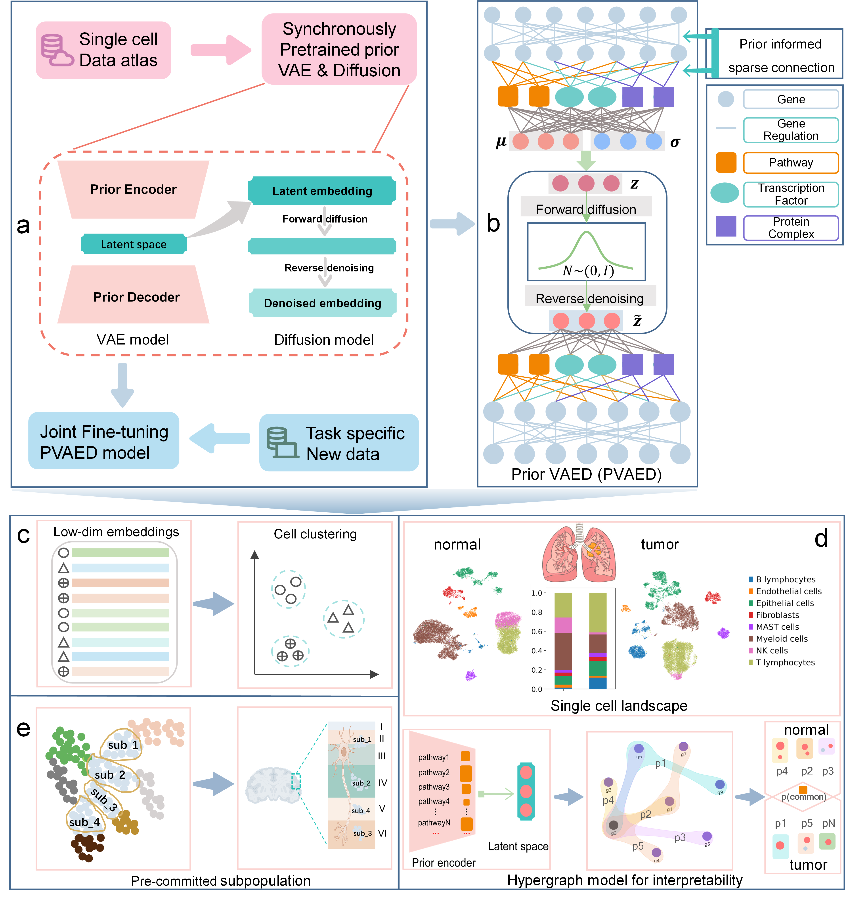

PVAED: Prior-Guided Variational Autoencoders with Diffusion Denoising for Interpretable Single-Cell Representation Learning
==============================================================================================================================

PVAED, a dimensionality reduction framework that integrates biological prior knowledge into a variational autoencoder (VAE) and further refines its latent embeddings with a diffusion-based denoising module.
Beyond performance, PVAED offers improved interpretability through its prior-based encoder design, enabling prioritization and modeling of interpretable biological variables as hypergraphs.

.. toctree::
   :maxdepth: 1

   down_stream

Overview of PVAED
============================

PVAED model schematic. a) The basic framework of PVAED model comprising a VAE model and a Diffusion model. After pre-training, the model undergoes joint fine-tuning with task specific new data. b) The detailed construction of PVAED. Prior information of pathway, TF-targets and protein complex are integrated as node in encoder layer. The connection between two encoder layer is sparsely connected informed by the gene-gene regulation or gene-prior object constituent relation. c) Low-dim cell embeddings from PVAED could be used for cell clustering task. d) VAED could be conducted for pathology related comparison task and then for interpretability task based on the trained prior encoder. e) PVAED could be instrumental in cell subpopulation discovery, uncovering subtle, pre-committed cellular subgroups. 

Installation
============ 
First clone the repository.

.. code-block:: python

   git clone https://github.com/MaLab-scGenomics/PriorVAED.git
   cd PVAED

It's recommended to create a separate conda environment for running PVAED:

.. code-block:: python

   #create an environment called PVAED_env using the environment.yml file.
   conda env create -f environment.yml

   #activate your environment
   conda activate PVAED_env

Then download data of GSE204684 at https://datasets.cellxgene.cziscience.com/c7e6fe97-f615-41e4-a631-0c3c74a7d20f.h5ad and preprocess the data as data_process.ipynb.

Finally, run the demo of GSE204684.

.. code-block:: python

   python3 manin.py && python3 main_joint_fine_tunning.py
The latent embedings and model checkpoint files will be saved in ./data_GSE204684_developing_human_cerebral_cortex folder.

.. note::

   If you want to change the model or path parameters, modify them in main.py or main_joint_fine_tunning.py directly in the parser part.
